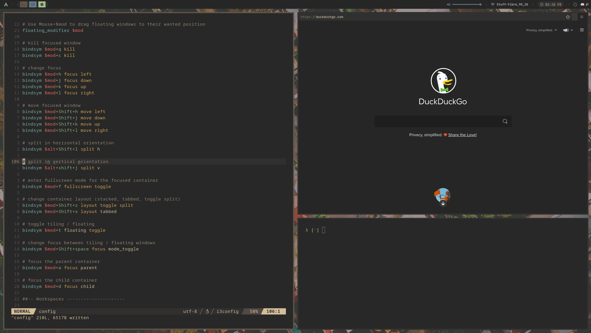

# archlabs-dotfiles

Personal dotfiles for Archcraft Linux

Here is a screenshot of my archcraft setup!

To install, install Archcraft OS, next install the i3wm archcraft package,
lastly install my terminal configs in nvim repository, install dependencies
for terminal applications (tmux, exa, lazygit, lazydocker, neovim, ...)

Enjoy :)
